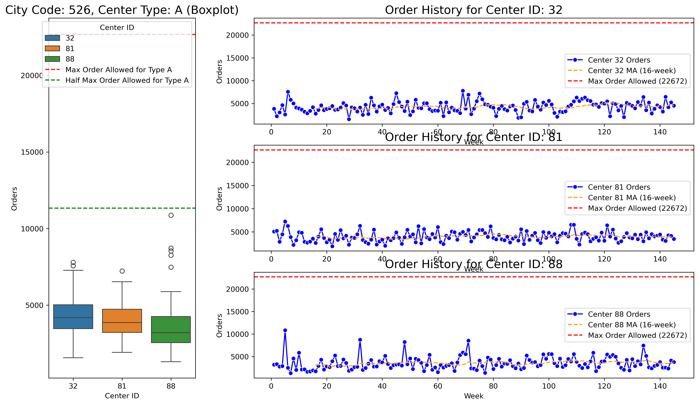
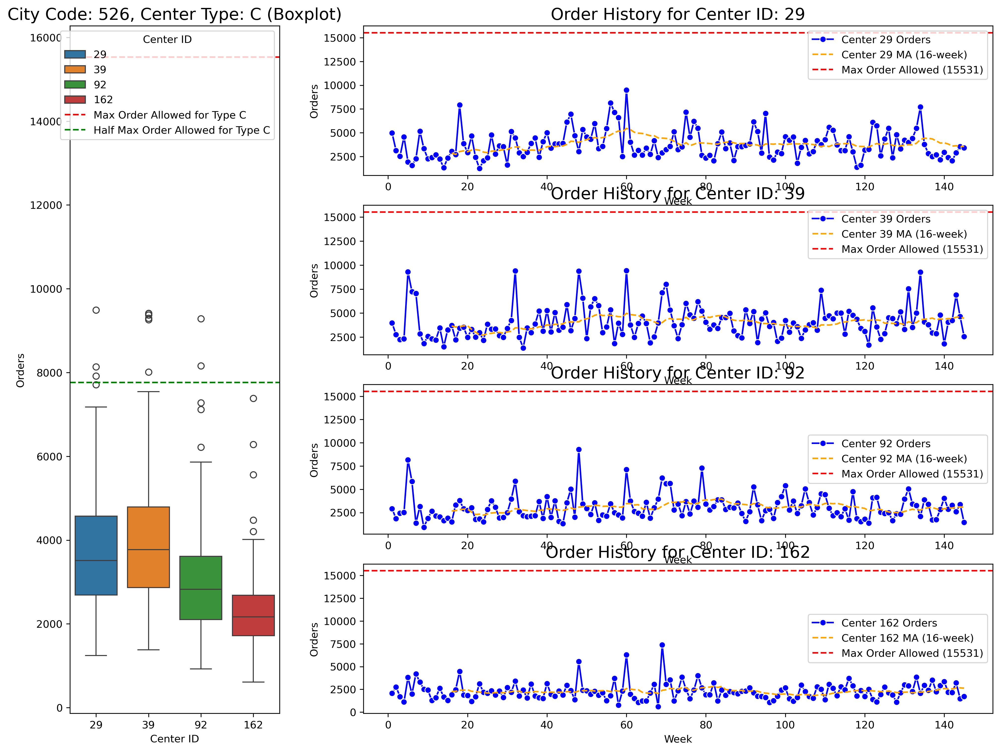
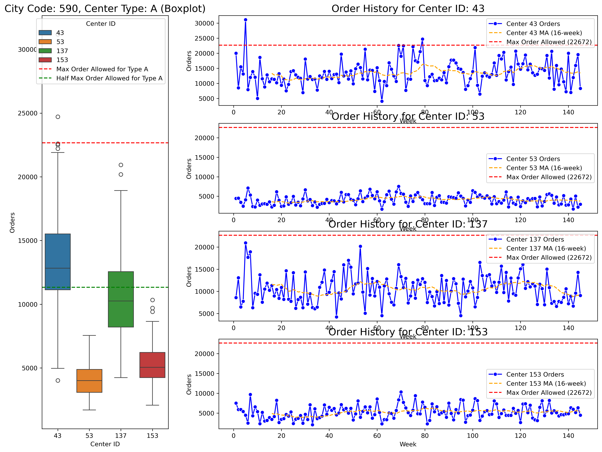
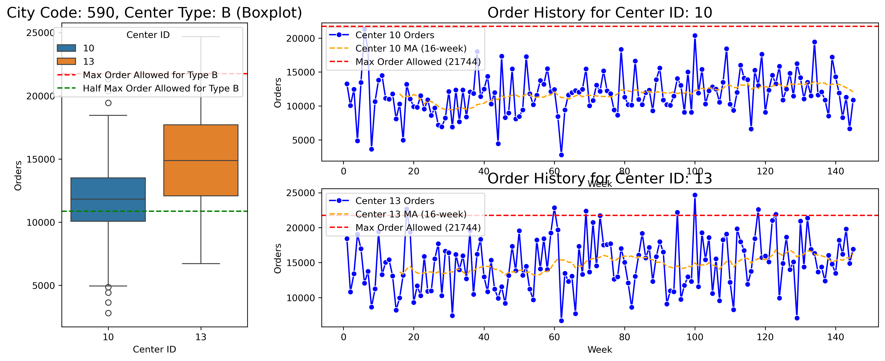

# Meal Deliveries Analysis

# How can a meal delivery service improve operations?

## Background
Your client is a food company in India that provides meal delivery services to thousands of customers per week. They operate in 51 cities inside eight different regions of the country. To better serve their customers, they deliver meals from 77 fulfillment centers.

The company wants you to help them understand their customer base, meal preferences, and fluctuations in orders. They want to investigate ways to improve operations and reduce food waste.

## The data

Your client has provided you with almost three years of order information for each of their 77 fulfillment centers:

- "week" - week (1 - 145)
- "center_id" - id of the fulfillment center
- "city_code" - city identifier
- "region_code" - region identifier
- "center_type" - there are three types of centers: A, B, and C
- "op_area" - the size of the area serviced by the fulfillment center
- "meal_id" - each meal has a unique id
- "category" - food category (beverages, pasta, rice, etc.)
- "cuisine" - the type of cuisine for each meal
- "checkout_price" - the price the customer pays (including discounts, promotions, etc.)
- "base_price" - list price for the meal
- "emailer" - 1 if there was an email promotion for the meal, 0 otherwise
- "featured" - 1 if the website featured the meal, 0 otherwise
- "orders" - number of orders for that week for that meal id

## Competition challenge

Create a report that covers the following:
1. What are the most popular food categories in each region?
2. For each of the two cities with more than three fulfillment centers, would you recommend:
	* Keeping the number of centers the same,
	* Combine fulfillment centers, or
	* Opening new centers
3. Investigate the effectiveness of email campaigns and promoting meals on the website.
4. Explore ways of forecasting food order numbers to assist purchasing managers in their planning.

# Executive Summary
## 1. Most popular food categories in each region

The most popular categories in all region is beverages. Followed by either rice bowl or sandwich.

## 2. Fulfilment Center Analysis
1. Merge 81 and 88 (City 526, Type A), 92 and 162 (City 526 Type C), 53 and 153 (City 590 Type A)
2. Add 1 type C near center id 43 (city 590 type A); Add 1 type C near center 13 (city 590 type B)

## 3. Promo Analysis
I did ANOVA with 1 factor which is promotion and 4 levels which are emailer, featured, both and no promotion.
I used tukey test as the post-hoc analysis when ANOVA found there is significant difference between levels.
Then based on tukey result I decide which promotion is the best.

## 4. Forecast food order numbers
I compare moving average 3 weeks, linear regression model and light gradient boosting model, with MAE as evaluation metrics. The features used are order week lag (the lag is based on PACF that is significant above/below confidence interval), discount as float, emailer as category and featured as category. The model is trained depends on city_code and meal_id. The user can request which meal_id, city_code to forecast and he/she can input discount, and any promotion. For transparency, I display the line plot and the MAE for each model, alongside the predicted orders for next week and let user decides which model to use.User should be informed on what to look on MAE (the lower is better).

One limitation of this model came from the train data. Current train data doesn't show discount or any promotion if there is no order in particular week (the week is skipped). But the model will retrain if newest dataset is available.

There is no perfect forecast. Purchasing manager and supply chain should also have flexibility if the forecast is under or over to reduce food waste and increase customer satisfaction.

Here is the sample output on test set. The annotation indicates discount, emailer (0 or 1, 1 means there is emailer) and featured (0 or 1, 1 means there is featured in company's website). Dataframe is also available as an output that can be then exported to csv or excel.

