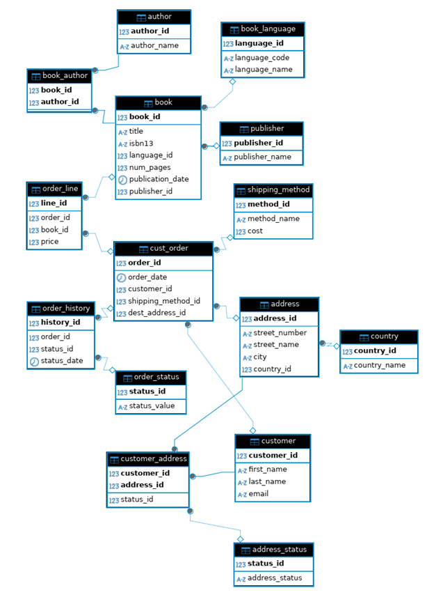

# Data Warehouse and Pipeline Design Docimentation

# Description
Pacbook, a company specializing in selling various books, aims to separate their transaction storage from the storage intended for analysis. Their transaction database is stored in postgres. It records each order details, book details and customer detail complete with dates for historical analysis. Here is another details that are found upon exploring their dataset:

  1. The main entity is customer order table (cust_order)
  2. Each order contains 1 or more book, and each book can have different price based on order_id. All of this detail is stored in order_line table. The order_line table doesn’t contain quantity so it is assumed that the quantity of each book title ordered is only 1 per order_id.
  3. Each book's order and delivery status is stored in the order_history table. Orders progress through statuses: "Order Received," "Pending Delivery", "Delivery in Progress", "Delivered", "Cancelled", or "Returned". The table records all statuses an order has passed through. It is assumed that the revenue generated depends on these statuses.
  4. Each customer can have multiple address, either active or inactive. However, even when the address status is inactive, the order can still be delivered. There is no record on when the address status is changed to be inactive or active. An address can also have multiple customer.
  5. A book can have multiple author and multiple author can write multiple book. 
  6. Same book title can have different publisher and language, however, they are assigned with different book_id.

# Problem Statement and Solution
## Problem
Stakeholder needs to separate the transaction storage with analytical storage. The metrics they wish to explore:
  1.	Monthly sales trends.
  2.	A list of books and their sales quantity over time.
  3.	Customer behavior: average time taken for repeat orders.
  4.	Customer segmentation: Identifying distinct groups pf customers based on their purchasing behavior, demographics, or other criteria.
  5.	Profitability analysis: determining the profitability of different products, customer segments, or sales channels to optimize business strategies.

## Solution
To enable easy, quick and automated analysis:
  - Need to build data warehouse using dimensional model (Kimball method).
  - Need to build data pipeline infrastructure to extract, transform data and load it into data warehouse.

# Data Warehouse Model Design
## Source Database
pacbook database

## ERD

## Dimensional Design Process
### Select Business Process
1. Book sales ordefct_bookr process
2. Customer purchase behavior

### Declare Grain, Dimensions and Facts
1. Book sales order process
Grain: One row represents order of a single book. The details include customer demographics; destination address; book author, publisher, publication date, language, number of pages; shipping method; order status including dates for each status; and lastly the date and time in which the order happen.
  - dim_customer
  - dim_address
  - dim_book
  - dim_author
  - bridge_book_author
  - dim_date
  - dim_time
  - fct_book_order

2. Customer purchase behavior
Grain: One row represents one customer behavior, including average time taken between order, demographics, their historical order detail, and historical book ordered.
  - dim_customer
  - fct_customer_behavior

### Bus Matrix

### Data Warehouse Schema: Dimension
#### Customer
Source:
  - customer
Sink: dim_customer

#### Book
Source:
  - book
  - publisher
  - book_language
Sink: dim_book

#### Bridge Book Author
Source:
  - book_author
Foreign key:
  - dim_author
  - dim_book
Sink: bridge_book_author

#### Author
Source:
  - author
Sink: dim_author

#### Address
Source:
  - address
  - country
Sink: dim_address

#### Date
Source:
  - (Generated) date
Sink: dim_date

#### Time
Source:
  - (Generated) time
Sink: dim_time

### Data Warehouse Schema: Fact
#### Book Order
Source:
  - cust_order
  - order_history
  - customer_address
  - address_status
  - shipping_method
  - order_line
  - order_status
Foreign key:
  - dim_customer
  - dim_address
  - dim_book
  - dim_date
  - dim_time
Sink: fct_book_order

#### Customer Behavior
Source:
  - cust_order
  - order_line
Foreign key:
  - dim_customer
  - dim_date
Sink: fct_customer_behavior

### Data Warehouse ERD

### Pipeline

### To do list
- Update the schema to better reflect the data warehouse
- Debug error related to duplicate primary key upon snapshotting. Plan: create intermediate schema to store dimension and fact and test the intermediate
- Create scheduler with cron
- Create email notification