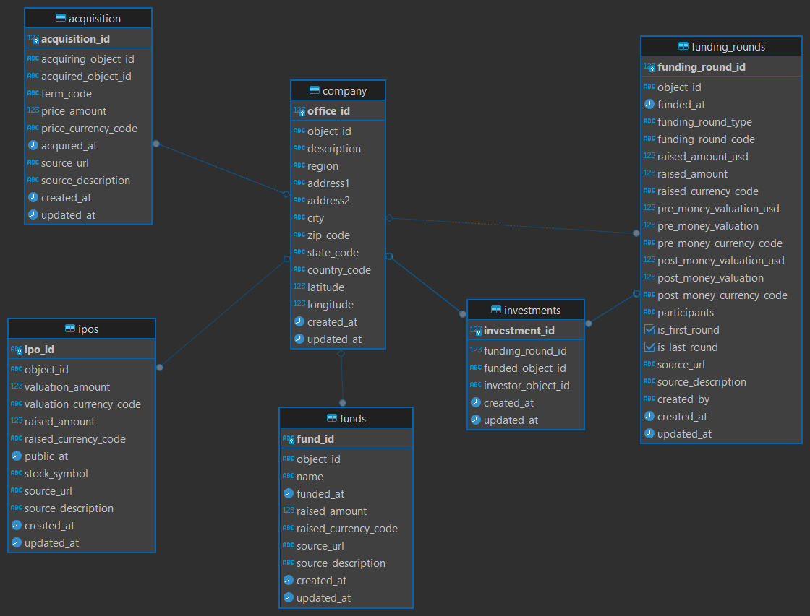
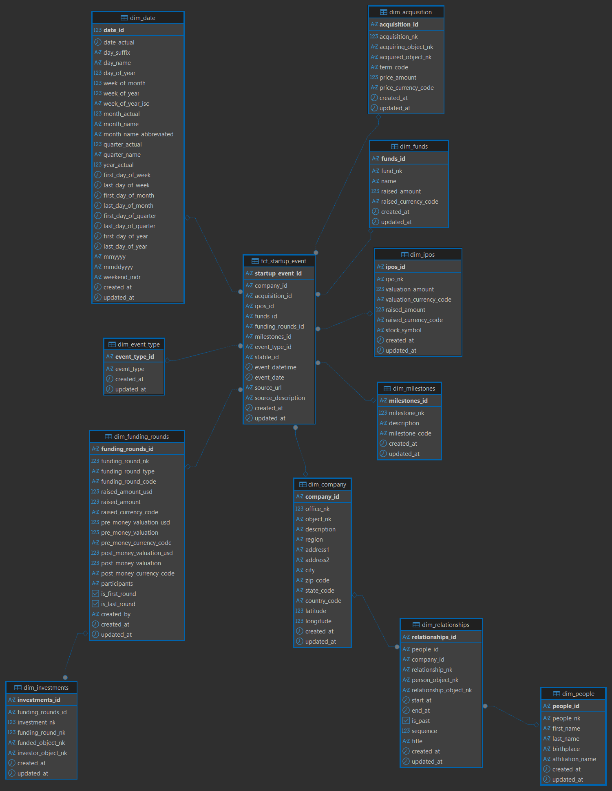
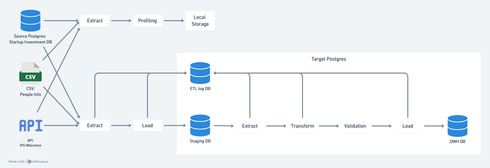

# Data Warehouse and Pipeline Design Documentation

# Description
The startup ecosystem is marked by its rapid growth and diverse range of activities. Within this ecosystem, a vast amount of data is generated. reflecting activities of companies, the investments they receive, and the key people associated with them. This data is critical for understanding market dynamics, identifying trends, and making informed decisions.

There are 3 data provided:
  1. Startup Investment Database: contains company, funds, acquisition, funding rounds, investments and IPOs table.
  2. Files with People Information: contains people and relationship associated with entities in the startup investment context.
  3. Company Milestone data from API: milestone records including creation and update timestamps, description, milestone date, and related URLs for further details.

Notable findings:
  1. Company is the main entity in the startup investment database. It has object_id as foreign key to all tables and has 'c' or 'f' prefix.

# Profiling Result:

# Problem Statement and Solution
## Problem
Public needs to track financial and milestone events for startups, focusing on funding, acquisitions, IPOs and milestones.

## Solution
To enable easy analysis, BI tools Tableau need to connect to dedicated data warehouse.

# Data Warehouse Model Design
## Source Database
  1. Startup Investment Database (postgres)
  2. Files with People Information (csv)
  3. Company Milestone data (API)

## Source Database ERD

## Dimensional Design Process
### Select Business Process
- Track financial and milestone events for startups

### Declare Grain, Dimensions and Facts
1. Track each financial and milestone events for startups.
Grain: One row represents a single startup event, which can be investment related events (funding or funded), funds, IPO, acquisition related event (acquiring or acquired) or milestone. The details include each event details, company, people and their relationship with the company.
  - dim_company
  - dim_acquisition
  - dim_ipos
  - dim_funds
  - dim_investments
  - dim_funding_rounds
  - dim_people
  - dim_relationships
  - dim_milestones
  - dim_date
  - dim_event_type
  - fct_startup_event

### Bus Matrix

### Data Warehouse Schema: Dimension
#### Company
Source:
  - source database company table
Sink: dim_company

#### Acquisition
Source:
  - source database acquisition table
Sink: dim_acquisition

#### IPOs
Source:
  - source database ipos table
Sink: dim_ipos

#### Funds
Source:
  - source database funds table
Sink: dim_funds

#### Investments
Source:
  - source database investment table
Sink: dim_investments

#### Funding rounds
Source:
  - source database funding_rounds table
Sink: dim_funding_rounds

#### People
Source:
  - people.csv
Sink: dim_people

#### Relationships
Source:
  - relationships.csv
Foreign key:
  - dim_people
Sink: dim_relationships

#### Milestones
Source:
  - Milestone API
Sink: dim_milestones

#### Event Type
Source:
  - generated
Sink: dim_event_type

#### Date
Source:
  - generated
Sink: dim_date

### Data Warehouse Schema: Fact
#### Startup Event
Source:
  - source database: acquisition
  - source database: ipos
  - source database: funds
  - source database: investments
  - source database: funding_rounds
  - API: milestone
Foreign key:
  - dim_company
  - dim_acquisition
  - dim_ipos
  - dim_funds
  - dim_funding_rounds
  - dim_milestones
  - dim_date
Sink: fct_startup_event

### Source to Target Mapping

### Data Warehouse ERD

### Pipeline
